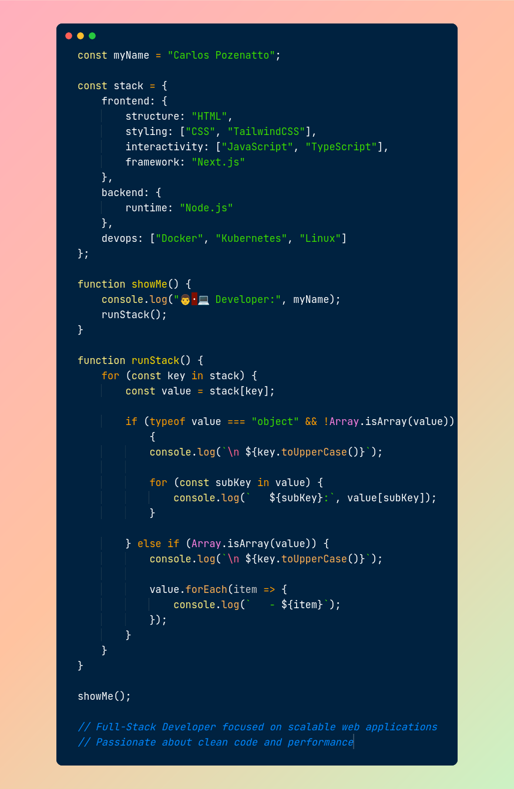

<!-- HEADER -->
<table>
  <tr align="top">
    <td align="top">
    

  

## 👨‍💻 Sobre mim
- 🎯 Focado em me tornar um desenvolvedor Full-Stack
- 💡 Interesse em desenvolvimento web e software
- 🚀 Buscando evolução constante e projetos reais

---

## 🧠 Tecnologias

  
  
  
  
  
  
    
  
  
  
  
  

    </td>
    <td></td>
  </tr>
</table>

## 🔥 Sequência de commits

  

<!-- ---

## 📌 Projetos em destaque

- 🚀 **Projeto 1** – descrição curta
- 💻 **Projeto 2** – descrição curta
- 📱 **Projeto 3** – descrição curta

---
-->
## 🌐 Contato

  
  

  💡 “Sempre evoluindo um pouco todos os dias.”

